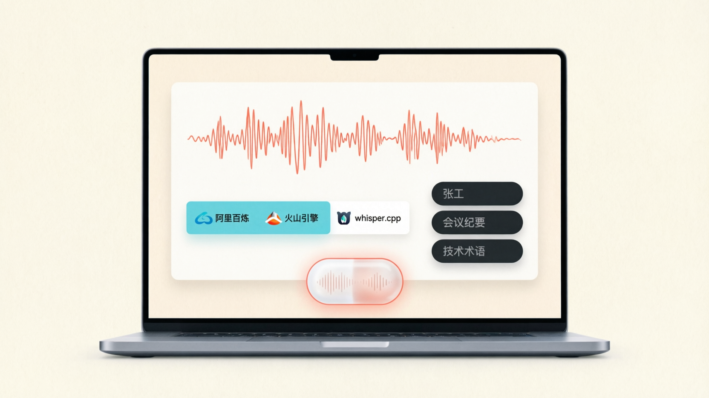

# VoiceVibe

> Open-source desktop voice typing inspired by Typeless.

<p align="center">
  
</p>

VoiceVibe 是一个桌面优先、开源、可私有化的语音输入工具。

它借鉴了 Typeless 这类产品里最顺手的交互模型:

1. 光标停在你已经在写的输入框里。
2. 按住一个键开始说话。
3. 松开按键立即转写。
4. 结果直接插回当前输入框，失败时自动回退到剪贴板。

但它走的是另一条产品路线:

- 开源，而不是黑盒订阅软件
- 自选 provider，而不是只能用单一后端
- 支持应用级个人词条库
- 支持完全本地的 `whisper.cpp`
- 不做手机端键盘，把精力集中在桌面体验
- 用 Electron 做桌面壳，方便未来继续扩到更多桌面平台

## 这是什么

VoiceVibe 目前是一个 `Electron + React + TypeScript` 桌面应用。

它的目标不是做一个“全平台什么都包”的输入法，而是把桌面语音输入这件事做好:

- `Fn` / `右 Command` 按住说话
- 松开即转写
- 自动插入当前输入框
- 四种 provider 可切换
- 个人词条库一次维护，多处复用
- 敏感内容可走纯本地识别

当前仓库已经从早期 Swift / iOS 原型切换到 Electron 方向。移动端不是主航线，桌面端才是。

## 核心卖点

- `桌面优先`: 真正适合长消息、文档、PR 评论、Prompt、知识库录入、客服回复、内部笔记。
- `四种 provider`: 阿里云百炼、火山引擎、本地 OpenWhisper、实验性 VibeVoice Server。
- `个人词条库`: 维护人名、产品名、项目代号、行业术语，火山引擎和 OpenWhisper 会自动吃到。
- `本地隐私模式`: 如果你不想把敏感输入发给第三方，直接跑 `whisper.cpp`。
- `开箱即用的配置说明`: 应用内直接给出官方开通入口、控制台位置、凭证字段说明、试用/计费提示。
- `完全免费`: VoiceVibe 本身没有订阅、没有账号系统、没有 Pro 版。
- `可 fork`: 你可以自己改 UI、换快捷键、换 provider、做私有发行。

## 为什么是桌面，不做手机端

VoiceVibe 不把手机端当主产品方向，这是刻意选择，不是偷懒。

原因很直接:

- 手机上的“纯语音键盘”经常不成立。很多场景里你只是想说一部分，剩下还得手打、改符号、移动光标、补一个名字。
- 当一个键盘被切进“纯语音模式”时，用户反而容易愣一下，不知道接下来该不该继续点、删、改。
- 第三方手机输入法本身就受系统约束，体验不稳定，尤其在 iPhone 上更明显。
- 微信输入法、豆包输入法已经验证了“按住说话”的需求，但它们没有把“用户自维护词条 + 完全本地识别”做成核心卖点。

更关键的是，Apple 自己的系统能力已经够强了。

根据 Apple 官方支持页面，在 2026 年 3 月 28 日能确认的信息包括:

- iPhone 听写时键盘可以保持打开，语音和手动输入可以混用。
- 听写支持标点、换行、删除、选择、撤销、重做等语音编辑命令。
- iPhone / iPad 有内建的 Text Replacement。
- Voice Control 可以导入自定义词汇列表。

这意味着:

- 手机上，Apple 自带听写已经是非常强的默认解法。
- 桌面上，VoiceVibe 才有明显的产品空间。

所以这个项目不会优先做手机端键盘。真的有手机需求，优先建议直接用 Apple 系统听写，或使用已经存在的成熟输入法。

## 为什么这件事依然值得做

因为这个交互已经被市场验证了。

公开资料里能看到:

- 微信输入法桌面端已经把 `Fn` 按住说话这件事带进主流用户心智。
- 豆包输入法也把语音输入、AI 修正等能力放进了核心卖点。
- Typeless 则把“跨应用按住说话 -> 松开插字”打磨成了一个成熟的商业产品。

VoiceVibe 不是在发明一个不存在的需求，而是在回答另外一个问题:

如果我喜欢这种交互，但我不想被一个封闭、订阅制、单后端的软件绑住，怎么办？

VoiceVibe 给出的答案是:

- 我把桌面交互层开源出来
- 我允许你自己选云厂商
- 我允许你完全本地跑
- 我允许你自己维护个人词条

## Provider 概览

| Provider | 适合谁 | 网络 | 你要准备什么 | VoiceVibe 里的增强 |
| --- | --- | --- | --- | --- |
| `DashScope` | 已经在用阿里云、想快速接通云端 ASR 的用户 | 云端 | API Key | 应用内直连开通文档、词表 JSON 导出、支持 `vocabulary_id` / `phrase_id` |
| `Volcengine` | 想直接传热词、做领域增强的用户 | 云端 | App Key / Access Token / Resource ID | 应用级 personal terms 会自动合并进 hotwords |
| `OpenWhisper` | 最在意隐私、希望完全离线的用户 | 本地 | `whisper.cpp` CLI + 模型 | 应用级 personal terms 自动变成 prompt hints |
| `VibeVoice Server` | 已经有 GPU 服务、想试长上下文和热词增强的用户 | 远端 / 自托管 | 你自己部署的 VibeVoice-ASR 服务 | 应用级 personal terms 自动并入 hotwords |

## 个人词条库

这是 VoiceVibe 和很多现成输入法相比，最值得强调的一点。

你可以维护自己的词条:

- 人名
- 公司名
- 产品名
- 英文缩写
- 行业术语
- 中英混杂的专有表达

当前行为:

- `Volcengine`: `personal terms + provider hotwords` 自动合并。
- `OpenWhisper`: `personal terms + provider hotwords` 自动变成 prompt hints。
- `VibeVoice Server`: `personal terms + provider hotwords` 自动并成上下文提示发给你的 VibeVoice 服务。
- `DashScope`: 因为接口本身更偏向云端词表 ID，应用会帮你导出阿里云词表 JSON，方便同步到官方 vocabulary。

这也是项目很重要的定位:

不是单纯“能语音输入”，而是“你能真正拥有自己的词汇层”。

## 完全本地模式为什么重要

如果你输入的是:

- 客户资料
- 内部文档
- 研发讨论
- 产品代号
- 代码注释
- 会议纪要草稿

那“能不能不把音频发给第三方”就是一个产品级问题，不是偏好问题。

`OpenWhisper` 路线的意义就在这里:

- 音频留在本机
- 转写留在本机
- 词条留在本机
- 应用本身也不需要账号系统

这不一定是最快、最省心的方案，但它是你能自己掌控的一条路。

## VoiceVibe 为什么免费

VoiceVibe 自己不卖语音额度。

它的商业逻辑很简单:

- 你用本地 `OpenWhisper`，那就没有云账单
- 你用阿里云或火山引擎，费用直接由你的云账号承担
- VoiceVibe 只做桌面输入层，而且保持免费和开源

也就是说，VoiceVibe 不靠把 UI 包一层再订阅化来赚钱。

## Typeless 价格为什么值得拿出来说

Typeless 是一个很强的参考产品，这件事必须承认。

但它也是商业软件。

根据 Typeless 官方定价与 billing 页面，在 `2026-03-28` 可以确认:

- 新用户有 `30 天 Typeless Pro` 试用
- 试用结束后会切回 `Free`
- `Free` 当前是 `每周 4,000 words`
- `Pro` 当前是 `12 USD / member / month`，按年计费
- 按月计费当前是 `30 USD / month`
- Typeless 官方 referral 页面还在提供 `每邀请 1 位完成 2,000 词输入的朋友，可得 5 美元 Pro credit`

这是一条完全合理的商业路线。

VoiceVibe 不跟 Typeless 比“商业打磨程度”，而是比另外几个维度:

- 你不用为 VoiceVibe 本身付订阅费
- 你不用注册 VoiceVibe 账号
- 你可以自己选 provider
- 你可以完全走本地模型
- 你可以自己 fork 出一版只服务你团队的版本

## 与微信输入法 / 豆包输入法的关系

它们不是“要被打败的竞品”，更像是需求验证器。

它们已经证明:

- 桌面语音输入是真的有人用
- `按住说话` 这个动作是真的顺手
- 大众用户愿意接受这种交互

VoiceVibe 要做的差异化是:

- 不采集你的输入内容做自己的产品闭环
- 不把你锁死在固定 provider
- 把个人词条库当成一等能力
- 给你完全本地的选项

## 快速开始

最快方式:

1. 打开仓库的 `Releases` 页面，下载最新 `macOS arm64` 或 `macOS x64` 安装包。
2. 打开应用后，先去设置页完成 provider 配置。
3. 按提示授权:
   - 麦克风
   - 辅助功能
4. 选择触发键:
   - `Fn` 按住说话
   - `右 Command` 按住说话
5. 把个人词条录进去，先跑一次手动录音测试。

本地开发:

```bash
npm install
npm run dev
```

本地构建:

```bash
npm run build
npm run dist:mac:arm64
```

更详细的首次上手说明见: [docs/quickstart.md](docs/quickstart.md)

## Release Workflow

仓库内置了 tag 触发的 GitHub Release 工作流:

- 推送 `v*` tag
- GitHub Actions 会分别构建 `macOS arm64` 和 `macOS x64`
- 产出的 `.dmg` 和 `.zip` 会自动挂到 GitHub Release

工作流文件:

- [release.yml](.github/workflows/release.yml)

## 仓库结构

- `src/main`
  Electron 主进程、IPC、录音运行时、provider 调度
- `src/preload`
  安全桥接层
- `src/renderer`
  设置页、状态页、词条库、历史记录 UI
- `src/shared`
  共享类型、默认配置、provider 引导信息
- `docs/quickstart.md`
  用户第一次安装和配置的文档
- `scripts/manage_hotwords.py`
  可选的 DashScope vocabulary 同步脚本
- `config/hotwords/voicevibe.fun-asr.json`
  DashScope 词表示例

## 当前范围

这版仓库明确聚焦:

- macOS 桌面发布
- Electron 架构
- 阿里云 / 火山 / 本地 whisper / 实验性 VibeVoice Server 四种 provider
- 应用级词条库
- GitHub Release 可下载安装包

不做:

- 手机端第三方输入法
- iOS 键盘扩展
- 账号系统
- SaaS 订阅

## 参考资料

产品与市场:

- Typeless 官网: <https://www.typeless.com/>
- Typeless Pricing: <https://www.typeless.com/pricing>
- Typeless Billing: <https://www.typeless.com/help/billing>
- Typeless Referral: <https://www.typeless.com/referral>

系统能力:

- Apple Dictation: <https://support.apple.com/guide/iphone/iph2c0651d2/ios>
- Apple Dictation Commands: <https://support.apple.com/guide/iphone/iph3bf19d7b9/ios>
- Apple Text Replacement: <https://support.apple.com/104995>
- Apple Voice Control 自定义词汇: <https://support.apple.com/guide/accessibility-mac/mchl3eb7b79a/mac>

Provider 官方资料:

- 阿里云百炼 API Key: <https://help.aliyun.com/zh/model-studio/get-api-key>
- 阿里云智能语音交互计费: <https://help.aliyun.com/zh/isi/product-overview/billing-10>
- 火山引擎豆包语音控制台: <https://console.volcengine.com/speech/app>
- 火山引擎快速入门: <https://www.volcengine.com/docs/6561/163043?lang=zh>
- 火山引擎流式语音识别文档: <https://www.volcengine.com/docs/6561/1354869?lang=zh>
- whisper.cpp: <https://github.com/ggml-org/whisper.cpp>
- Microsoft VibeVoice: <https://github.com/microsoft/VibeVoice>
- VibeVoice-ASR 文档: <https://github.com/microsoft/VibeVoice/blob/main/docs/vibevoice-asr.md>
- VibeVoice vLLM 部署: <https://github.com/microsoft/VibeVoice/blob/main/docs/vibevoice-vllm-asr.md>
- VibeVoice-ASR Hugging Face: <https://huggingface.co/microsoft/VibeVoice-ASR>

市场验证:

- 微信输入法 Mac App Store: <https://apps.apple.com/us/app/%E5%BE%AE%E4%BF%A1%E8%BE%93%E5%85%A5%E6%B3%95/id1618175312>
- 豆包输入法 App Store: <https://apps.apple.com/cn/app/%E8%B1%86%E5%8C%85%E8%BE%93%E5%85%A5%E6%B3%95/id6752316550>
